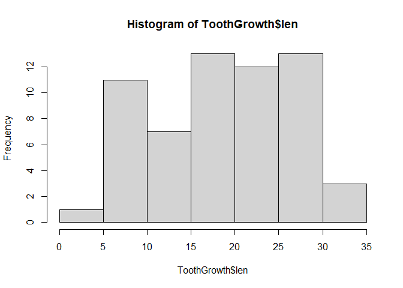

# Overview

We are going to take a look at the toothgrowth data set and make some exploratory analysis and hypothesis tests.

The ToothGrowth data set is the observation of the effect of vitamin C on tooth growth in Guinea Pigs.

The response is the length of odontoblasts (cells responsible for tooth growth) in 60 guinea pigs. Each animal received one of three dose levels of vitamin C (0.5, 1, and 2 mg/day) by one of two delivery methods, orange juice or ascorbic acid (a form of vitamin C and coded as VC).

# Exploratory data analysis

First, load the datasets package that has the ToothGrowth data set.


```r
library(datasets)
```

Let's take a look at the variables.


```r
str(ToothGrowth)
```

```
## 'data.frame':	60 obs. of  3 variables:
##  $ len : num  4.2 11.5 7.3 5.8 6.4 10 11.2 11.2 5.2 7 ...
##  $ supp: Factor w/ 2 levels "OJ","VC": 2 2 2 2 2 2 2 2 2 2 ...
##  $ dose: num  0.5 0.5 0.5 0.5 0.5 0.5 0.5 0.5 0.5 0.5 ...
```

We have 60 observations of two numeric variables and one factorial with two level to work with.

Let's look at a summary of it.


```r
summary(ToothGrowth)
```

```
##       len        supp         dose      
##  Min.   : 4.20   OJ:30   Min.   :0.500  
##  1st Qu.:13.07   VC:30   1st Qu.:0.500  
##  Median :19.25           Median :1.000  
##  Mean   :18.81           Mean   :1.167  
##  3rd Qu.:25.27           3rd Qu.:2.000  
##  Max.   :33.90           Max.   :2.000
```

So, we have 30 observations with orange juice (OJ) and 30 with ascorbic acid (VC). Doses range from 0.5 to 2.0, as designed for the experiment. 

The len variable is the response variable, which is the length of odontoblasts, and it has a wide range, from 4.2 to 33.9, with 50% of the responses lower than 19.25. 

Mean and median are close to each other, which suggests data doesn't have outliers, which can misguide summary calculations.


```r
hist(ToothGrowth$len)
```

<!-- -->

---

# Hypothesis Test

Here, we are interested in knowing if there was any real difference of effect on the length of odontoblasts, either by dose or supplement type.

We need to use the t-distribution to do this, and two conditions are assumed of the data:

* **Independence of observations.** It's a good assumption since the experiment was done with random assignments.

* **Observations come from a nearly normal distribution.** This one is more trick. If we are talking about the supplement type, we have 30 observations of each, so, from the CLT, we are very confident that whatever the point estimate we choose, it can be considered nearly normal because the higher the sample size, more normal the distributions of point estimates get, and 30 is a good sample size for that. But if we look at dose, we have 20 observations of each, so we're gonna have to assume the point estimate is from a nearly normal distribution here.

Now let's go ahead and do the tests.

### For supplement type

Here, we have the following hypothesis:

* H0: There is no difference in average length of odontoblasts for Guinea Pigs who received supplement VC and OJ.

* HA: There is some difference in average length of odontoblasts for Guinea Pigs who received supplement VC and OJ.

We are going to do a two sided test and check at a significance level of 5% the hypothesis. 


```r
t.test(x = subset(ToothGrowth, supp == 'VC')$len, 
       y = subset(ToothGrowth, supp == 'OJ')$len,
       alternative = 'two.sided', 
       conf.level = .95, 
       paired = F)
```

```
## 
## 	Welch Two Sample t-test
## 
## data:  subset(ToothGrowth, supp == "VC")$len and subset(ToothGrowth, supp == "OJ")$len
## t = -1.9153, df = 55.309, p-value = 0.06063
## alternative hypothesis: true difference in means is not equal to 0
## 95 percent confidence interval:
##  -7.5710156  0.1710156
## sample estimates:
## mean of x mean of y 
##  16.96333  20.66333
```

The result of the test show p-value to be 0.060, which is higher than our set significance level, so we fail to reject the null hypothesis here. We can't say there is a difference between length of odontoblasts from the two groups. 

## For dose level

We have just failed to reject that the difference between supplements is 0. Now, let's test extremes dose levels. Here is the hypothesis tests:

* H0: There is no difference in average length of odontoblasts for Guinea Pigs who received 0.5 and 2 mg/day of supplement.

* HA: There is some difference in average length of odontoblasts for Guinea Pigs who received 0.5 and 2 mg/day of supplement.

Once again, we are going to do a two sided test and check at a significance level of 5% the hypothesis.


```r
t.test(x = subset(ToothGrowth, dose == .5)$len, 
       y = subset(ToothGrowth, dose == 2)$len,
       alternative = 'two.sided', 
       conf.level = .95, 
       paired = F)
```

```
## 
## 	Welch Two Sample t-test
## 
## data:  subset(ToothGrowth, dose == 0.5)$len and subset(ToothGrowth, dose == 2)$len
## t = -11.799, df = 36.883, p-value = 4.398e-14
## alternative hypothesis: true difference in means is not equal to 0
## 95 percent confidence interval:
##  -18.15617 -12.83383
## sample estimates:
## mean of x mean of y 
##    10.605    26.100
```

Here, we got a different result from previously. We reject the null hypothesis because the p-value is way lower than the significance level we chose. Even if the significance level was lower, it is very very unlikely that the null hypothesis is true. So we can be confident in saying there is some difference in average length of odontoblasts for Guinea Pigs who received 0.5 and 2 mg/day of supplement.


